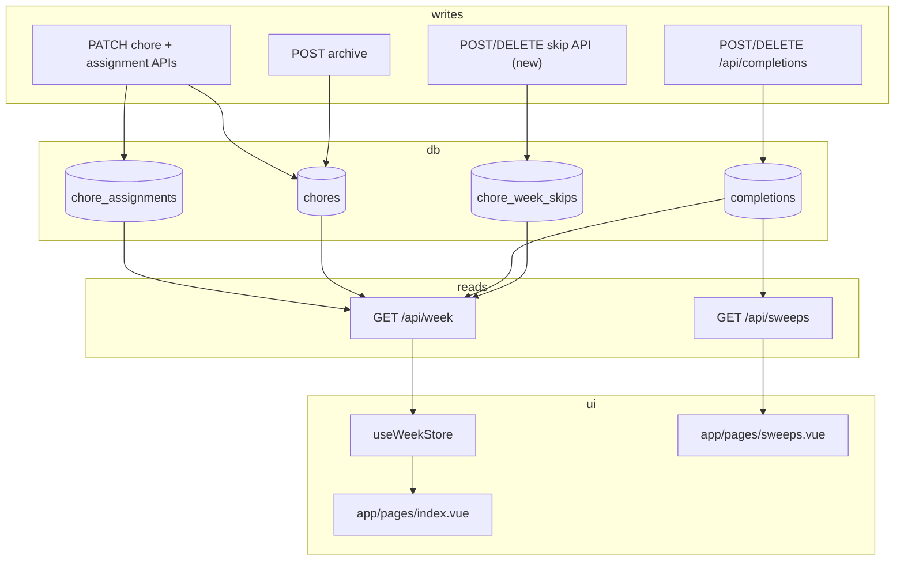

# Research: codebase seams for `chore_week_skips`

**Ticket:** [Research: codebase seams for week-scoped chore skips](https://github.com/papadok24/sweepy/issues/86) (Wayfinder map [Wayfinder: Week-scoped chore skip (skip this week)](https://github.com/papadok24/sweepy/issues/84))  
**Branch:** `research/chore-week-skips-seams`  
**Status:** Research only — no implementation.

**Product language:** Canonical term is **Rain check** (see `CONTEXT.md` on `domain/rain-check`, [What should we call a week-scoped chore skip in the domain model?](https://github.com/papadok24/sweepy/issues/85)). This note still uses the proposed table name `chore_week_skips` and informal “skip” for code seams; UI/domain copy should say Rain check.

## Proposed model (starting point, not decided)

From [Wayfinder: Week-scoped chore skip (skip this week)](https://github.com/papadok24/sweepy/issues/84):

```text
chore_week_skips (chore_id, week_start)
```

- **Chore-scoped**, not per-day — one row hides the chore from **all** day buckets for that week (confirmed: Rain check is chore-wide).
- `week_start` = Monday ISO date (`YYYY-MM-DD`) in the household timezone — same identity as Completions (`CONTEXT.md` Week; `server/db/schema.ts` completions table).
- Assignments and `chores.active` stay unchanged; a Rain check is reversible and week-scoped (distinct from Archive). Active Chores only.

**Not in repo today:** no table, API route, type field, or test helper references rain checks / skips.

---

## Schema & migration pattern

### Current domain tables

| Table | Role | Relevant to skips |
| --- | --- | --- |
| `chores` | Active/archived chore catalog | Skip applies only to `active = true` chores |
| `chore_assignments` | Current schedule (day buckets) | Unchanged by skip; still defines *where* chore would appear |
| `completions` | `chore_id + day_of_week + week_start` | Coexists with skip rows — interaction TBD ([#92](https://github.com/anthonykoch/sweepy/issues/92)) |
| `household_settings` | Timezone for `week_start` / today | Skip rows use same `currentWeekClock()` as completions |

Source: `server/db/schema.ts` (lines 13–58).

### Likely new table shape

Mirror `completions` week scoping, but **without** `day_of_week`:

```typescript
// Illustrative — not implemented
export const choreWeekSkips = sqliteTable('chore_week_skips', {
  id: integer('id').primaryKey({ autoIncrement: true }),
  choreId: integer('chore_id').notNull().references(() => chores.id),
  weekStart: text('week_start').notNull(),
  skippedAt: integer('skipped_at').notNull().$defaultFn(() => Date.now()),
}, table => [
  uniqueIndex('chore_week_skips_chore_week_unique').on(table.choreId, table.weekStart),
])
```

**Patterns to follow:**

- **Migration:** Drizzle SQL files under `server/db/migrations/sqlite/` — latest is `0005_mysterious_emma_frost.sql`; next would be `0006_*.sql` + snapshot in `meta/`. Journal: `server/db/migrations/sqlite/meta/_journal.json`.
- **Apply:** `pnpm db:migrate` (NuxtHub); CI deploy runs same path ([ADR 0009](docs/adr/0009-ci-deploy-atomic-d1-migrations.md)).
- **Unique conflicts:** use `withUniqueConflict` from `server/utils/db-errors.ts` (same as completions POST).
- **D1 write terminals:** prefer `.returning()` on insert/delete ([ADR 0001](docs/adr/0001-cloudflare-d1-via-nuxthub.md), `test/unit/d1-write-terminals.spec.ts`).
- **Seed wipe order:** `scripts/seed.ts` deletes `completions` → `chore_assignments` → `chores` (lines 62–65); add `chore_week_skips` before `chores` in that chain.

### ADR consideration

- **Completions** deliberately have no FK to assignments ([ADR 0003](docs/adr/0003-completions-independent-of-assignments.md)) so history survives schedule edits.
- Skips are week-scoped visibility, not history — FK to `chores.id` is natural; no assignment FK needed (chore-level hide).

---

## Read paths (filter skip rows)

### 1. `GET /api/week` — primary board read

**File:** `server/api/week.get.ts`

Current flow:

1. Resolve `weekStart` + `todayDayOfWeek` via `currentWeekClock()` (lines 9–10).
2. Join active chores → assignments (lines 12–22).
3. Load all completions for `weekStart` (lines 24–27).
4. Push every assignment into `days[].assignments` with completion flags (lines 38–48).

**Integration seam:** After step 2 (or before step 4), load skip rows for `weekStart` and either:

- **Omit** skipped chores from `assignments` (simplest — board behaves as if chore not scheduled this week), or
- **Include** with a new field (e.g. `skipped: true`) if UX wants a visible “skipped” row ([#89](https://github.com/anthonykoch/sweepy/issues/89)).

Query sketch:

```typescript
const weekSkips = await db
  .select({ choreId: schema.choreWeekSkips.choreId })
  .from(schema.choreWeekSkips)
  .where(eq(schema.choreWeekSkips.weekStart, weekStart))
const skippedChoreIds = new Set(weekSkips.map(s => s.choreId))
// filter rows or annotate in assembly loop (lines 38–48)
```

**Downstream:** Every consumer of `WeekView` inherits this shape.

### 2. `WeekView` / `WeekDayEntry` types

**File:** `shared/types/week.ts` (lines 1–22)

Today:

```typescript
export type WeekDayEntry = {
  choreId: number
  choreName: string
  choreNotes: string | null
  choreListItems: string[]
  completed: boolean
  completedAt: number | null
}
```

**Integration seam:** If skipped chores are omitted at API level, types stay unchanged. If shown differently on the board, add optional `skipped?: boolean` (and possibly drop `completed` semantics for skipped rows).

Re-exported from `server/api/week.get.ts` (line 7) and `app/composables/useWeekStore.ts` (lines 1–3).

### 3. Today assignments + Full sweep — `app/pages/index.vue`

**Today list** (lines 298–301): `todayAssignments` reads `week.value.days[todayIndex].assignments` — no local filtering. Skip filtering must happen in `GET /api/week` or here.

**Full sweep** (lines 315–328, 351–353, 386–388):

```typescript
function isTodayFullSweep(): boolean {
  const slots = todayAssignments.value
  return slots.length > 0 && slots.every(slot => slot.completed)
}
```

**Integration seam ([ #90](https://github.com/anthonykoch/sweepy/issues/90)):** If skipped slots are omitted from `todayAssignments`, denominator shrinks automatically. If skipped slots remain visible, Full sweep logic must exclude them (treat like “not assigned today”). Edge case: **all** today assignments skipped → `slots.length === 0` → no Full sweep (matches “empty today is not a Full sweep” in `CONTEXT.md`).

**Toggle path** (lines 369–400): `onToggle` → `toggleCompletion` — skipped chores should not reach here if omitted from the list; otherwise guard in UI or store.

### 4. `useWeekStore` — client read/write hub

**File:** `app/composables/useWeekStore.ts`

| Function | Lines | Skip impact |
| --- | --- | --- |
| Hydrate | 19–24 | `$fetch('/api/week')` — receives filtered Week |
| `toggleCompletion` | 86–117 | Assumes assignment exists in snapshot; POST `/api/completions` |
| `setCompleted` | 67–78 | Local optimistic patch |
| `currentDaysForChore` | 119–126 | Used by edit save — skip does not remove assignments |
| `applyChoreEditLocally` / `saveChoreEdit` | 128–212 | Day membership only; skip row untouched |
| `archiveChore` | 264–267 | Rehydrate after archive — skip rows on archived chore TBD ([#84](https://github.com/anthonykoch/sweepy/issues/84)) |
| `refreshWeek` / `rehydrateFromServer` | 80–84, 284–286 | Picks up skip state from server |

**New store methods (not yet specified):** `skipChore(choreId)` / `unskipChore(choreId)` — optimistic vs await-and-refresh follows ADR 0006 pattern (completions = optimistic; add/archive = await).

### 5. Edit drawer — `app/pages/index.vue`

**Hydrate edit state** (lines 151–172): Scans `week.value.days` for chore membership. If skipped chores are **omitted** from Week API, user cannot open Edit from a board row for that chore this week (only from another week or a dedicated skip UI ([#88](https://github.com/anthonykoch/sweepy/issues/88))).

**Save / archive** (lines 211–267): PATCH chore + assignment APIs — no skip awareness today.

### 6. Completions API (read side via week)

**Files:**

- `server/api/completions.post.ts` (lines 13–31) — verifies assignment exists + chore active before insert.
- `server/api/completions/[choreId]/[dayOfWeek].delete.ts` (lines 25–33) — deletes completion for current week only.

**Integration seam ([#92](https://github.com/anthonykoch/sweepy/issues/92)):** POST should reject (404/409) when chore is skipped this week, unless product allows complete-while-skipped. DELETE unchanged.

### 7. Sweeps aggregation

**File:** `server/api/sweeps.get.ts` (lines 43–63)

Counts **all** `completions` rows in filter window — no assignment or skip join. Sparkle totals and per-chore rankings derive purely from completion rows.

**File:** `server/utils/sweeps.ts` — pure helpers over pre-aggregated counts; **no skip hook** unless `sweeps.get.ts` changes input data.

**Integration seam ([#91](https://github.com/anthonykoch/sweepy/issues/91)):** Product must decide whether skipped weeks:

- Ignore completions in that week for rankings,
- Treat as zero sparkles (miss),
- Or leave counts unchanged (skip = board-only).

**Client:** `app/pages/sweeps.vue` (lines 16–24) — `$fetch('/api/sweeps')` only; no Week coupling.

### 8. Other reads (low / no change)

| Path | File | Notes |
| --- | --- | --- |
| Active chore list | `server/api/chores/index.get.ts` | `active = true` only — skips invisible |
| Placeholders | `server/api/placeholders.get.ts` | Unrelated |
| Chore create | `server/api/chores/index.post.ts` | Creates assignments, not skips |

---

## Write paths (mutate skip rows)

### New endpoints (expected — not in repo)

Likely mirror completions week scoping:

| Action | Suggested route | Body / params | DB |
| --- | --- | --- | --- |
| Skip this week | `POST /api/chores/:id/skip` or `POST /api/skips` | `{ choreId }` + server stamps `weekStart` | `INSERT` into `chore_week_skips` |
| Unskip | `DELETE /api/chores/:id/skip` | path `choreId` + current `weekStart` | `DELETE` skip row |

Use `currentWeekClock(event).weekStart`, `requireActiveChore()`, `withUniqueConflict` for duplicate skip.

**Vitest-only fixture route** (pattern): `server/api/__test__/skips.post.ts` + `insertSkip()` in `test/helpers/fixtures.ts` — mirrors `completions.post.ts` / `insertCompletion()` for arbitrary `weekStart`.

### Existing writes that may touch skips

| Endpoint | File | Skip interaction |
| --- | --- | --- |
| Archive chore | `server/api/chores/[id]/archive.post.ts` (lines 10–15) | Sets `active = false` only; does not delete completions. **Open:** delete orphan skip rows on archive? |
| PATCH chore | `server/api/chores/[id].patch.ts` | Name/notes only — no skip |
| POST assignment | `server/api/chores/[id]/assignments/index.post.ts` | Adds day bucket — skip row still hides all buckets |
| DELETE assignment | `server/api/chores/[id]/assignments/[dayOfWeek].delete.ts` | Schedule edit — skip unchanged |
| POST completion | `server/api/completions.post.ts` | Should conflict with skip row if both allowed ([#92](https://github.com/anthonykoch/sweepy/issues/92)) |
| DELETE completion | `server/api/completions/[choreId]/[dayOfWeek].delete.ts` | Independent of skip |
| Create chore | `server/api/chores/index.post.ts` | No skip on create |

### Zod schemas

**File:** `server/utils/chore-schemas.ts` — add skip/unskip body validators alongside `completeBody` (lines 32–35).

---

## Test seams

### API helpers & types

| File | Role | Skip extension |
| --- | --- | --- |
| `test/helpers/api-types.ts` | `WeekView`, `Completion`, `SweepsSnapshot` | Add `ChoreWeekSkip` type; optional `skipped` on `WeekDayEntry` |
| `test/helpers/fixtures.ts` | `insertCompletion`, `countCompletionsForChore` via `/api/__test__/*` | Add `insertSkip({ choreId, weekStart })`, `countSkipsForChore` |
| `test/helpers/week-board.ts` | `createChore`, `assignChore`, `findAssignmentById`, `checkboxSelector` | Helpers to assert chore absent/present on week; skip/unskip API wrappers |

**Existing test-only completion routes:**

- `server/api/__test__/completions.post.ts` (lines 19–36) — explicit `weekStart` insert
- `server/api/__test__/completions.get.ts` — count by `choreId`

Mirror for skips avoids second SQLite client ([`fixtures.ts` comment](test/helpers/fixtures.ts), lines 4–8).

### API test suites

| File | What to extend |
| --- | --- |
| `test/api/server.spec.ts` | `describe('week view and completions API')` (line 379): skipped chore absent from week; completion POST rejected when skipped; unskip restores visibility |
| `test/api/sweeps.spec.ts` | Sparkle counts under skip policies ([#91](https://github.com/anthonykoch/sweepy/issues/91)) |
| `test/api/week-timezone-boundary.spec.ts` | Skip `week_start` aligns with household TZ at week rollover |

### E2E suites

| File | What to extend |
| --- | --- |
| `test/e2e/week-board.spec.ts` | Hydrate + toggle — skipped chore no checkbox / no row |
| `test/e2e/full-sweep.spec.ts` | `completeOtherTodaySlots`, `isTodayFullSweep` scenarios — skipped slots excluded from denominator ([#90](https://github.com/anthonykoch/sweepy/issues/90)) |
| `test/e2e/edit-chore.spec.ts` | Edit entry when chore skipped (depends on UX [#88](https://github.com/anthonykoch/sweepy/issues/88)) |
| `test/e2e/chore-sounds.spec.ts` | Completion sounds — no play on skipped row |

### Unit

| File | Role |
| --- | --- |
| `test/unit/d1-write-terminals.spec.ts` | Template for skip insert/delete `.returning()` / `.run()` |

---

## Integration map (data flow)



---

## Open product decisions blocking implementation

These sibling tickets lock behavior at the seams above:

| Ticket | Question |
| --- | --- |
| [#85](https://github.com/anthonykoch/sweepy/issues/85) | Domain term for skip vs Archive |
| [#87](https://github.com/anthonykoch/sweepy/issues/87) | Current week only vs skip future week |
| [#88](https://github.com/anthonykoch/sweepy/issues/88) | UX entry (edit drawer vs row action) |
| [#89](https://github.com/anthonykoch/sweepy/issues/89) | Omitted vs visible “skipped” on Week board |
| [#90](https://github.com/anthonykoch/sweepy/issues/90) | Full sweep denominator when skips present |
| [#91](https://github.com/anthonykoch/sweepy/issues/91) | Sweeps sparkle treatment for skipped weeks |
| [#92](https://github.com/anthonykoch/sweepy/issues/92) | Skip ↔ completion precedence; unskip cleanup |

---

## Recommended implementation order (when spec is locked)

1. Schema + migration + `insertSkip` test fixture.
2. Skip/unskip API routes + `chore-schemas` validators.
3. **`GET /api/week` filter/annotate** — unlocks most UI behavior.
4. **`completions.post` guard** — prevent inconsistent skip+complete state.
5. **`useWeekStore` skip/unskip** + UI entry ([#88](https://github.com/anthonykoch/sweepy/issues/88)).
6. **Full sweep** adjustments in `index.vue` if skipped rows remain visible.
7. **Sweeps** aggregation policy in `sweeps.get.ts`.
8. Archive lifecycle for orphan skip rows.
9. API + e2e tests per tables above.
